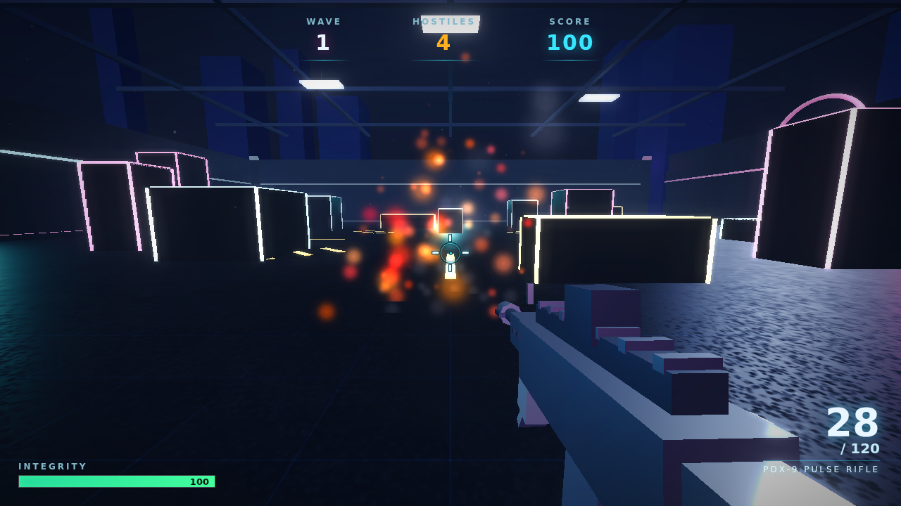

# GAUNTLET — a Neon Arena FPS built with the Gauntlet Loop

A first-person shooter that runs in a browser. **Every mesh, texture, sound, and
effect is generated in code** — there is not a single external asset. It was built
using the **Gauntlet Loop** method: set an ambitious goal, give the agent a hard bar
it can't talk its way around, split the work, and never let the builder grade itself.

> The Gauntlet Loop method is by Matt Shumer — *["How to Run a Gauntlet Loop: The
> Prompting Method Behind Claude of Duty"](https://somethingbig.ai/gauntlet-loop)*.



---

## Play it

It's a single, self-contained web page — no build step, no server dependencies.

```bash
# from the repo root, serve the folder (any static server works):
python3 -m http.server 8080
# then open http://localhost:8080
```

Opening `index.html` directly via `file://` also works in most browsers.

**Controls:** `WASD` move · `MOUSE` aim · `CLICK` fire · `R` reload · `SHIFT` sprint ·
`SPACE` jump · `RIGHT-CLICK` aim-down-sights · `ESC` pause.

Survive escalating waves of hostiles in a neon arena. Clearing a wave refills your
magazine and patches your armor. Headshots (the glowing core) deal double damage.

---

## The Gauntlet Loop, applied

The method (paraphrasing the guide):

1. **Give it the goal, not the implementation.** The goal here: *a modern, AAA-quality
   first-person shooter, in Three.js, with zero external assets.*
2. **Give it a real bar.** The bar is a concrete AAA arena-shooter rubric
   (Call of Duty / DOOM Eternal / Destiny) — see [`tools/GAUNTLET_BAR.md`](tools/GAUNTLET_BAR.md).
   The reference wins by default; the loop only stops closing gaps when you stop it.
3. **Split the work** into the smallest pieces that can be improved and judged
   separately: **lighting & atmosphere**, **environment art**, **enemy design**,
   **weapon & gunplay**, and **HUD & juice**.
4. **Never let the builder grade itself.** Each piece is judged by a **fresh, blind
   critic** running in its own clean context. Critics don't get the builder's
   rationale — they **render the actual pixels themselves** (headless Chromium) and
   compare what they see against the bar, then hand back the single biggest gap.
5. **Loop.** Builder fixes the biggest gap → re-render → critic again → repeat.
6. **Smoothing pass** at the end so the separately-improved pieces feel like one thing.

### How the critics see real pixels

Because "the critic should inspect the real thing… the real pixels," this repo ships a
headless-Chromium screenshot harness, [`tools/shoot.mjs`](tools/shoot.mjs). A critic
renders representative frames and *looks at them*:

```bash
# establishing / menu shot
node tools/shoot.mjs index.html shots/menu.png 1500 "wait800"
# live combat, aimed at a hostile, muzzle flash + impacts
node tools/shoot.mjs index.html shots/combat.png 250 "start,wait2500,aim,gunfire"
```

The game exposes a tiny `window.__GAUNTLET` hook (autostart / aimNearest / fire) purely
so automated critics can frame real combat without a human at the mouse.

See [`docs/LOOP_LOG.md`](docs/LOOP_LOG.md) for the round-by-round record of what each
blind critic flagged and what changed in response.

---

## What's under the hood (all procedural)

- **Rendering:** Three.js (r128, vendored in `vendor/`), `UnrealBloomPass` for the neon
  glow, ACES filmic tone mapping, soft-shadowed moonlight, exponential fog.
- **World:** a walled arena with neon strips, corner pylons, and cover — geometry placed
  in code, surfaces textured with procedurally-drawn `<canvas>` textures.
- **Enemies:** built from primitives with an emissive core; wave spawner with escalating
  count/health/speed and three archetypes (drone / spitter / brute).
- **Gunplay:** hitscan with spread, recoil, additive muzzle flash + dynamic light,
  pooled tracers and impact sparks, reload, ADS.
- **Feel:** GPU-points particle system, screen shake, hit markers, damage vignette,
  score popups, kill feed.
- **Audio:** a small WebAudio engine — every gunshot, impact, and ambience is synthesized
  live (no sound files).

## Repo layout

```
index.html            the game page + HUD (HTML/CSS)
game.js               all game logic, rendering, audio (single file)
vendor/three.min.js   Three.js r128 (vendored so the game has no external deps)
vendor/postprocessing.js  bloom chain (EffectComposer + UnrealBloomPass)
tools/shoot.mjs       headless-Chromium screenshot harness for blind critics
tools/GAUNTLET_BAR.md the concrete AAA quality bar the loop judges against
docs/LOOP_LOG.md      round-by-round Gauntlet Loop record
```

`package.json` / `node_modules` exist only for the dev tooling (vendoring Three.js and
running the screenshot harness). The game itself needs none of it.
