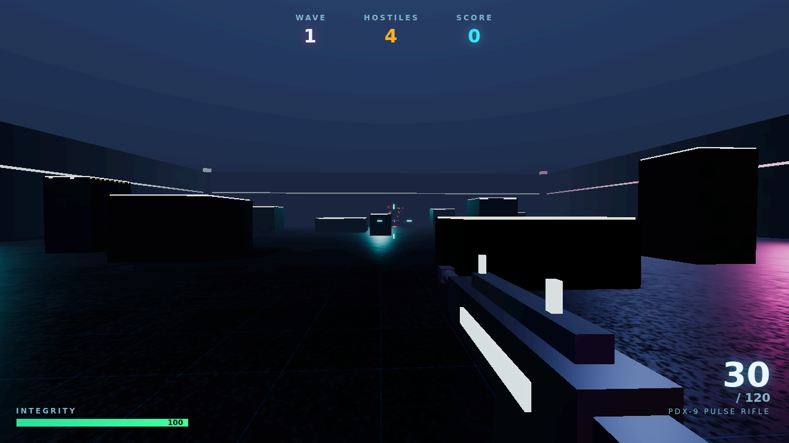
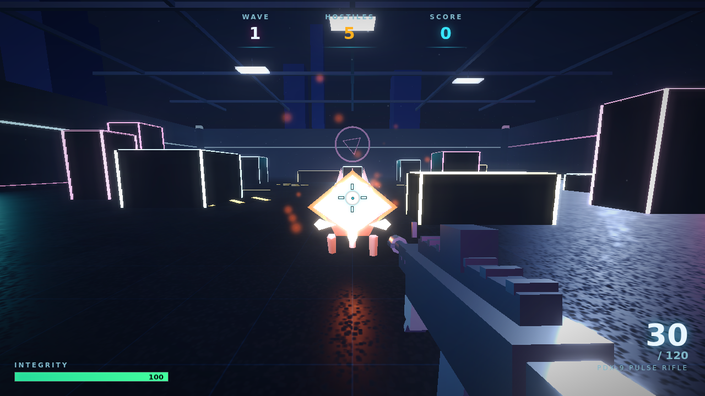
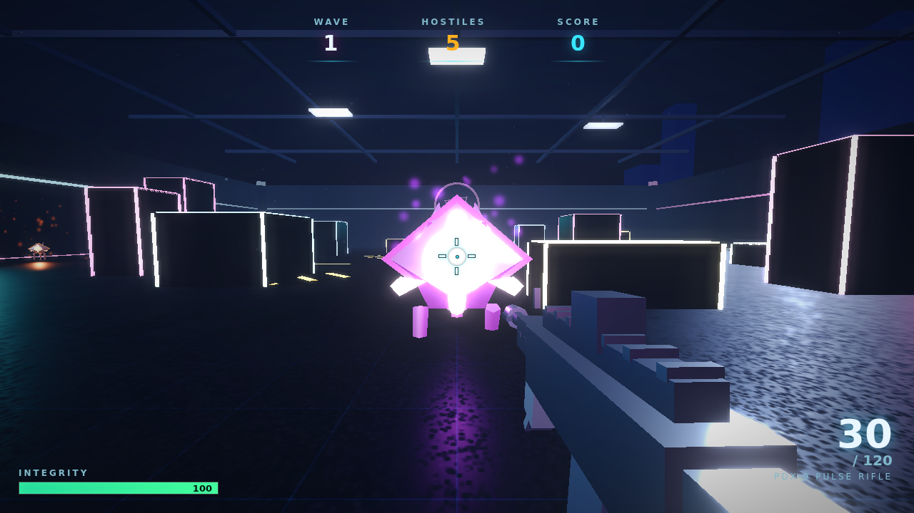
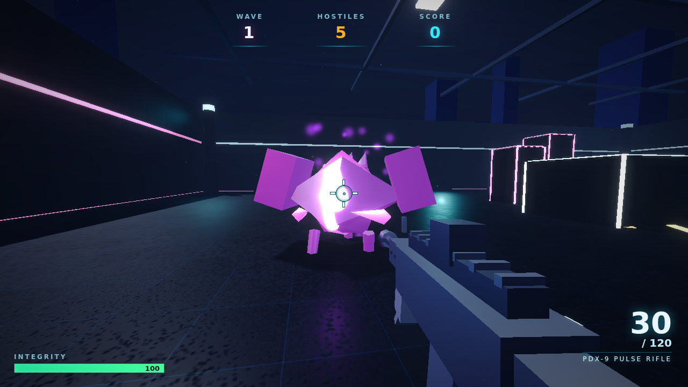
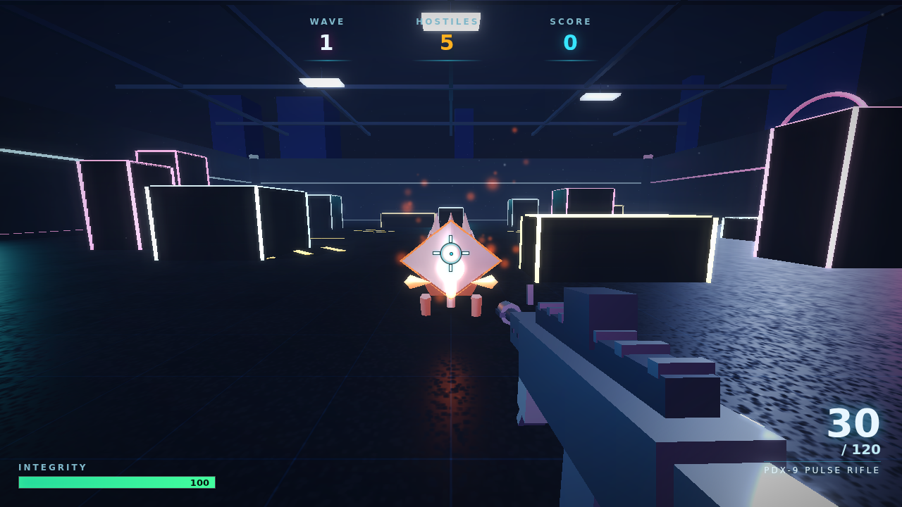
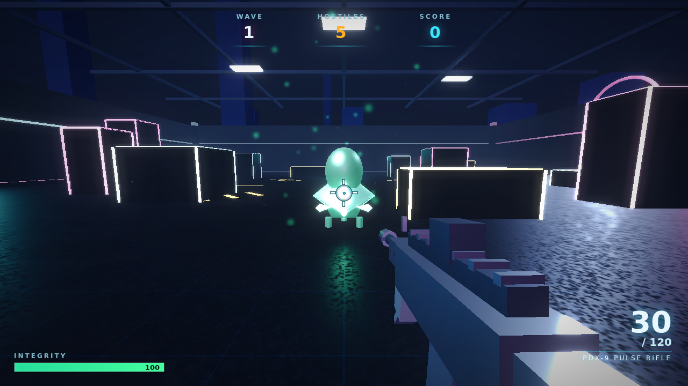

# Gauntlet Loop — Round Log

A record of the split → build → **blind critic** → repeat cycle. Each critic runs in a
fresh context and judges one dimension by inspecting the **actual rendered pixels**
against the AAA bar in [`../tools/GAUNTLET_BAR.md`](../tools/GAUNTLET_BAR.md).

## Round 0 — Baseline

First working build: a functional, atmospheric neon arena FPS with all core systems
(waves, hitscan gunplay, three enemy types, particles, bloom, HUD, procedural audio).
Known-fair starting point — deliberately handed to the gauntlet before hand-tuning.

## Round 1 — Five blind critics, five dimensions

Five independent critics each rendered the game themselves and reported the single
biggest gap vs the bar. They converged hard on one systemic failure: **the dark grade
crushed every surface to pure black**, so nothing read as lit form.

| Dimension | Biggest gap the blind critic found | What the builder changed |
|---|---|---|
| **Lighting / atmosphere** | Every vertical face crushed to `#000`; no fill/rim; fog was a black crush | Strong opposing fill + ambient so faces read as *tinted* shadow; luminous haze fog (`0x1b2b4a`); bloom threshold `0.9→0.62`, strength up; exposure `1.05→1.14`; a vignette + shadow-tint grade pass |
| **Environment art** | Top ~40% empty sky; cover were black blobs; no set-dressing | Overhead truss + hanging light panels; distant city silhouettes; a giant far-wall sigil; glowing **vertical** edge posts on cover (varied heights); floor-base neon runs + hazard chevrons as leading lines; floating dust motes |
| **Enemy design** | Body color ≈ the crates → no silhouette; you tracked a floating spark | Inverted-hull **rim outline** (glows against the dark); lifted albedo + constant under-glow; bigger, hunched, forward-leaning silhouette with swept blades + mandibles; animated leg stride + a menace telegraph (eye glares brighter as it closes) |
| **Weapon / gunplay** | A black slab with blown-white nubs; no dedicated lighting | A **viewmodel-only light rig** (own render layer) so it reads as metal without lighting the world; detailed receiver/handguard/optic/foregrip + gloved hands; punchier multi-frame muzzle flash; stronger recoil kick |
| **HUD / juice** | Crosshair + hitmarker nearly invisible; HUD leaked behind the menu | High-contrast crosshair (ring + cross + dot, dark outline, tighter spread); scale-pop hitmarker with a red KILL variant; bigger crit popups + score pop; hit-stop on kills; directional damage indicators; framed topbar; gameplay HUD hidden until in-game |

All five critics also independently hit a harness bug — `page.screenshot` timing out at
30s under concurrent load — which was fixed (`animations:'disabled'` + 120s timeout).

**Before → after (enemy readability):**

| Round 0 | Round 1 |
|---|---|
|  |  |

## Round 2 — Fresh critics on the improved build

Three new blind critics rendered the Round 1 result. Scores rose across the board
(HUD 3–6 → 6–7; art 2–4 → 4–6), and they found sharper, subtler gaps — including
that Round 1 had **over-corrected** the enemies.

| Dimension | Biggest remaining gap | What the builder changed |
|---|---|---|
| **Combat feel** | The additive core + full-body rim blew every enemy into a featureless white "gem"; the three types differed only by hue | Dimmer core (`3.2→1.25`) + tiny pupil; **thin** outline rim (`1.14→1.06`); dimmer per-enemy light; rebalanced global bloom (`0.82→0.66`); **per-type silhouettes** — brute gets armored shoulder plates, spitter a bulbous gland head, drone a lean hunch |
| **Fire feedback** | Flash unreliable (blown or missed), no persistent tracer/recoil | Controlled multi-frame muzzle flash (smaller footprint, longer life) + smoke puff; brighter, longer tracer beam; a camera recoil punch; hot-white spark shards on impact |
| **Art direction** | Surfaces read as untextured black boxes; ceiling panels didn't bloom; floor neon looked like "lasers through geometry" | Shared bump/detail map on walls + cover (real surface relief); tiled+repeated wall texture; brighter blooming light panels; floor-hugging neon trim; moved the far-wall sigil off-center so it stops competing with the reticle |
| **HUD / presentation** | Crosshair still faint; weapon-name illegible; menu button read as a web form; HUD leaked behind the menu | Higher-contrast crosshair ring + dark stroke; legible weapon name (top rule + glow); a proper AAA menu CTA (bordered, glowing, breathing, sheen); confirmed HUD is hidden until in-game |

**Before → after (enemy differentiation — the brute gains armored shoulders):**

| Round 1 | Round 2 |
|---|---|
|  |  |

The three archetypes now read at a glance:

| Drone | Spitter | Brute |
|---|---|---|
|  |  |  |

The bar is deliberately unreachable — this is where the run was **stopped**, not where
it "finished." With a higher bar there is always another gap to close.

